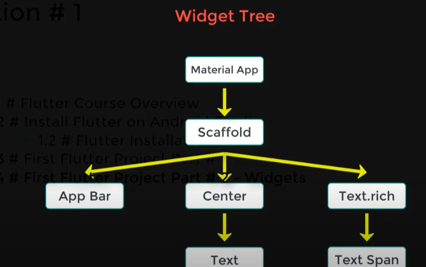
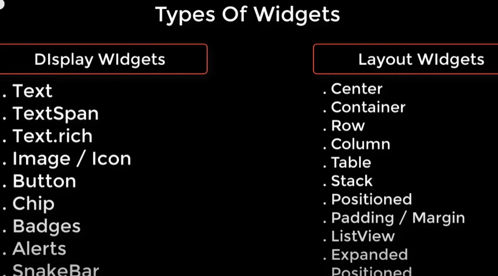

[icons](https://api.flutter.dev/flutter/material/Icons-class.html)
- use to organize the code
> alt + ctrl + l
- use before the widget to make it child for another widget
> alt + enter
- use inside the widget to show the property
> __ctrl__ + space